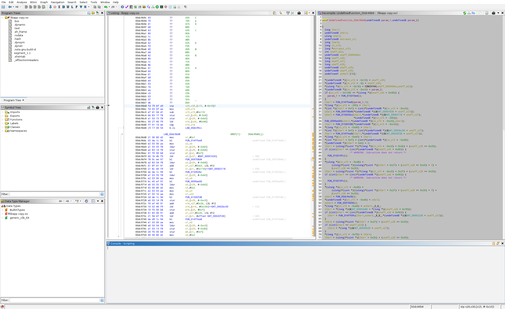
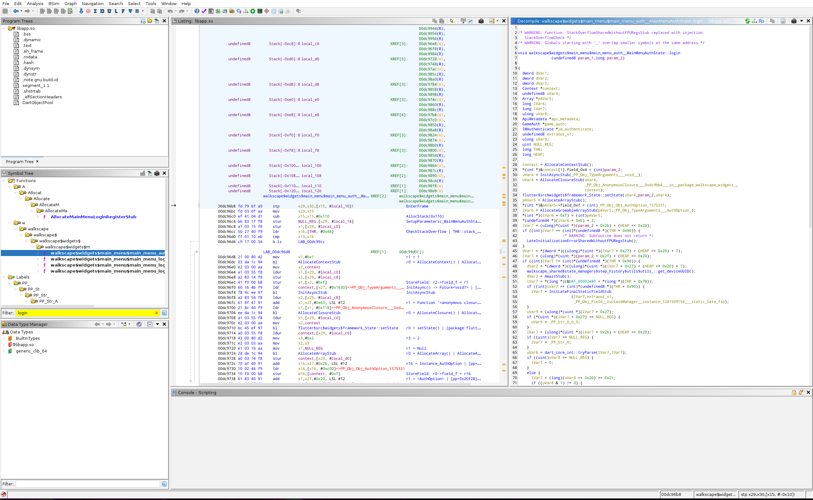

# B(l)utter - Ghidra patch

Adds (ai slop) Ghidra support to blutter

Running blutter creates `ghidra.json` that can be imported with `ghidra_import_blutter.py`. A slightly modified `AARCH64_dartaot.cspec` is included to help Ghidra with the dart VM oddities.

Before



After



Could be improved. Doesn't do anything about compressed pointers. Fields on structs are a bit wonky due to hack for darts pointer tag stuff. Native code not great thanks to setting x15 as the stack pointer. Servicable

## Usage

* Run blutter as normal
* Run Ghidra with `AARCH64_dartaot.cspec` in `$GHIDRA_INSTALL_DIR/Ghidra/Processors/AARCH64/data/languages`
* Import libapp.so in Ghidra. Base offset of 0x0. Use the dartaot compiler
* Run `ghidra_import_blutter.py` in ghidra. This line probably needs changing first

```python
json_path = os.path.join(script_dir, "..", "..", "dumps", "blutter-out", "ghidra.json")
```

## Further Reading

Dart Decompilation and the Impact on Flutter™ App Security <https://www.guardsquare.com/blog/obstacles-in-dart-decompilation-and-the-impact-on-flutter-app-security>

zboralski/unflutter: Static analyzer for Flutter/Dart AOT snapshots <https://github.com/zboralski/unflutter>

Neoxs/reverse_flutter. older similar attempt <https://github.com/Neoxs/reverse_flutter>
